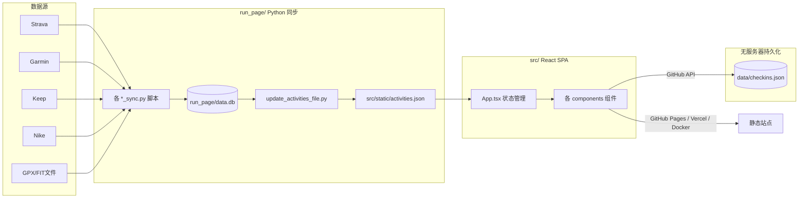

# Workout Log（Workout Dashboard）项目介绍文档

## 一、项目概述

**Workout Log** 是一个基于 `React 18 + TypeScript + Vite` 构建的现代运动数据看板，用于可视化展示跑步、骑行、徒步、健身等多种运动类型的数据。其数据来源于 [running_page](https://github.com/yihong0618/running_page) 项目的同步脚本（位于本仓库的 `run_page/` 目录），最终生成静态 JSON 由前端读取并渲染。

项目定位：**无后端、纯静态前端 + Python 数据管线**。所有运动数据在构建期静态加载，没有运行时 API；打卡功能则通过 GitHub REST API 直接读写仓库内的 JSON 文件实现"无服务器"持久化。

在线演示：`zhaohongxuan.github.io/workouts`

## 二、技术栈

| 类别 | 技术 |
|---|---|
| 框架 | React 18 + TypeScript |
| 构建 | Vite 6 |
| 样式 | Tailwind CSS v4（CSS 变量驱动主题） |
| 图表 | Recharts（柱状图/折线图） |
| 地图 | Mapbox GL + react-map-gl（轨迹地图）；自绘 SVG（中国省份地图） |
| 路线解码 | @mapbox/polyline |
| 数据管线 | Python（running_page 同步脚本 + SQLite） |
| 部署 | GitHub Pages（GitHub Actions）+ Vercel + Docker |

## 三、整体架构



**关键架构要点**（来自 `CLAUDE.md`）：
- 前端是**无路由的单页应用**，所有数据构建期静态加载自 `src/static/activities.json`。
- 全局状态集中在 `App.tsx`：`filter`（运动类型筛选）、`year`（年份）、`selectedActivity`（热力图/地图/列表共享选中项）、`selectedProvince`（省份筛选）、`page`（home/tracks/checkin 三页切换）。
- `filtered` 数据经 `useFilteredActivities` 计算后传给大部分组件；`ProfileCard` 和 `PersonalBest` 接收未过滤的全量数据以始终展示历史总计。
- 主题与强调色通过 CSS 变量实现：`<html data-filter>` 属性驱动 `--color-accent`（all=紫、Run=橙、Ride=蓝、Hike=绿、Gym=玫红），并联动 `body` 的运动主题色渐变背景（底色随白天/黑夜切换）。

## 四、核心功能特性

- **活动热力图**：GitHub 风格年度热力图，按运动类型区分颜色，支持月度展开与"全部年份"堆叠视图。
- **轨迹墙**：SVG 路线缩略图墙，自动聚合相似路线，按年份筛选。
- **路线地图**：Mapbox 交互式地图，展示所有 GPS 轨迹，支持全屏。
- **中国足迹地图**：自绘 SVG 中国省级地图，可缩放/拖拽，点击省份筛选该省活动。
- **个人最佳（PR）**：5K / 10K / 半马 / 全马距离的最佳成绩（含 GPS 有效性校验）。
- **数据统计**：年度/月度/周度目标进度及与去年同期对比。
- **连续记录**：连续打卡天数与周数、周历一览。
- **打卡系统**：俯卧撑 / 深蹲 / 冷水澡三项每日打卡，基于 GitHub API 持久化，支持 iOS 快捷指令。
- **健身记录**：力量训练、综合训练、楼梯机、水上运动等非有氧运动独立展示。
- **双语 + 深色模式**：中/英一键切换，主题跟随系统或手动切换（localStorage 持久化）。
- **运动全局筛选**：全部 / 跑步 / 骑行 / 徒步 / 健身。

## 五、目录结构与各文件作用

### 1. 根目录文件

| 文件 | 作用 |
|---|---|
| `README.md` | 项目说明文档，含功能、技术栈、快速开始、数据源接入、部署方式。 |
| `CLAUDE.md` | 面向 Claude Code 的架构与开发约定（命令、状态管理、i18n/主题模式、数据形状等）。 |
| `config.yml` | **应用核心配置文件**（无需改代码即可个性化）：默认语言/主题、运动目标（年度/月度/周度，距离或时长单位）、GitHub 打卡的 `githubClientId`/`repoOwner`/`repoName`。 |
| `CONTRIBUTING.md` | 贡献指南。 |
| `CHANGELOG.md` | 版本变更记录。 |
| `LICENSE` | MIT 许可证。 |
| `package.json` | 前端依赖与脚本（`dev`/`build`/`preview`/`data:*`）。 |
| `pnpm-lock.yaml` / `yarn.lock` / `pdm.lock` | 不同包管理器锁文件；当前主要使用 `pnpm`。 |
| `tsconfig.json` / `tsconfig.tsbuildinfo` | TypeScript 配置与构建缓存信息。 |
| `vite.config.ts` | Vite 配置：插件（React、Tailwind v4、YAML）、别名 `@`→`/src`、`@config`→根 `config.yml`、`base` 由 `PATH_PREFIX` 环境变量决定。 |
| `vite-env.d.ts` | Vite 环境类型声明。 |
| `index.html` | HTML 入口，内置主题预加载脚本（在 React 加载前根据 localStorage/系统偏好提前加 `dark` 类，避免闪烁），挂载 `#root`。 |
| `vercel.json` | Vercel 部署配置（`/(.*)` 重写到首页以支持 SPA）。 |
| `Dockerfile` | 多阶段构建：Python 3.10 跑数据同步 → Node 18 装前端依赖并 `pnpm build` → nginx 托管 `dist`。支持通过 ARG 传入各平台密钥。 |
| `pyproject.toml` / `requirements.txt` / `requirements-dev.txt` | Python 运行/开发依赖（running_page 数据管线所需，如 stravalib、gpxpy、garmin-fit-sdk、sqlalchemy 等）。 |
| `.github/workflows/gh-pages.yml` | 部署工作流：push 到 `master` 时，用 Node 20 + pnpm 构建（`PATH_PREFIX=/仓库名`），上传 `dist` 至 GitHub Pages；支持数据文件缓存与 `workflow_dispatch`/`workflow_call` 触发。 |
| `data/checkins.json` | **打卡数据**（由 GitHub API 读写），结构见 `src/types/checkin.ts`。 |
| `docs/` | 补充文档：`2026-05-15-modern-ui-design.md`（UI 设计说明）、`ios-shortcuts.md`（iOS 快捷指令打卡方案）。 |
| `public/` | 静态资源：`favicon.svg`、`404.html`、`images/`（图片）。 |
| `run_page/` | Python 数据同步层（详见下文）。 |
| `src/` | 前端源代码（详见下文）。 |

### 2. `src/` 前端源码

**入口与配置**
- `main.tsx`：React 入口，`createRoot` 渲染 `<App />`。
- `App.tsx`：应用根组件，管理全局状态并组装三页布局（home / tracks / checkin）。
- `config.ts`：读取构建期由 `config.yml` 转换的配置，导出 `DEFAULT_LOCALE`、`DEFAULT_THEME`、`GOALS`、`DEFAULT_GOAL`。
- `i18n.ts`：中英双语翻译字典 `messages`（zh/en 扁平 key-value）。
- `types.ts`：核心类型 `Activity`、`SportFilter`、`WorkoutType`、`WORKOUT_TYPES`（健身类子类型）。
- `index.css`：全局样式 + 全部 CSS 变量（颜色主题、暗色模式、动画 keyframes）。
- `vite-env.d.ts`：Vite 类型声明。
- `static/activities.json`：生成的活动数据（构建期静态加载，核心数据源）。
- `static/site-metadata`：站点元数据（logo 等，被 `BrandingBar` 引用）。
- `assets/avatar.jpg`：个人头像。
- `assets/china-provinces.json`：中国省级地图 GeoJSON（被 `ChinaMap` 懒加载）。

**类型定义 `src/types/`**
- `checkin.ts`：打卡相关类型 `Checkin`、`CheckinData`、`CheckinItem`、`GitHubUser`、`CheckinDefaults`。

**Hooks `src/hooks/`**
- `useActivities.ts`：数据过滤与格式化工具核心（`formatDistance`、`formatPace`、`parseMovingTime`、`formatDuration`、`useFilteredActivities`、`getAvailableYears`、`extractProvince`）。
- `useLocale.tsx`：国际化 Context，提供 `{ locale, setLocale, t }`，`t('key')` 取翻译，localStorage 持久化。
- `useTheme.ts`：深浅主题切换，切换 `<html>` 的 `dark` 类并持久化。
- `useCheckins.ts`：通过 GitHub API 读取/写入 `data/checkins.json`，提供 `checkins`、`todayCheckin`、`saveCheckin`、`loading`、`saving`、`error`。
- `useGitHubAuth.ts`：对 `useGitHubAuthContext` 的再导出（兼容旧引用）。
- `useGitHubAuthContext.tsx`：GitHub PAT 认证 Context，登录后从 `localStorage` 持久化 token 与用户信息，并通过 `api.github.com/user` 校验。

**组件 `src/components/`（按职责分组）**
- 导航与概览：`Header.tsx`（顶部导航：首页/轨迹墙/打卡切换、运动类型筛选、主题与语言切换）、`BrandingBar.tsx`（品牌署名栏，含 logo）、`HeroStats.tsx`（Hero 概要统计：总距离/次数/时长/最长距离/最佳速度/连续天数）、`StatsCards.tsx`（目标进度卡片 + 连续记录）、`ProfileCard.tsx`（个人数据摘要，始终用全量数据）。
- 可视化图表：`ContributionHeatmap.tsx`（年度热力图）、`HeatmapPage.tsx`（全年份热力图总览页）、`MonthlyChart.tsx`（月度统计柱状图）、`TrendCharts.tsx`（趋势折线图）、`CalendarWidget.tsx`（月度日历，hover 显示当日公里数）。
- 轨迹与地图：`RouteMap.tsx`（Mapbox 交互式轨迹地图，支持全屏）、`TracksPage.tsx`（轨迹墙页面，SVG 路线缩略图聚合 + 年份筛选）、`ChinaMap.tsx`（中国省份足迹地图，可缩放/平移、点击省份筛选）。
- 记录列表：`ActivityLog.tsx`（活动记录分页表格，年份/距离筛选）、`ActivityList.tsx`（活动列表，支持卡片/表格视图与按日期/距离/配速排序）、`PersonalBest.tsx`（5K/10K/半马/全马 PR）。
- 健身专区：`WorkoutPage.tsx`（健身记录独立页面：力量训练/综合训练/楼梯机/水上运动，按时长统计）。
- 打卡专区：`CheckinPage.tsx`（打卡主页，组合下列组件）、`CheckinCard.tsx`（今日打卡卡片：俯卧撑/深蹲/冷水澡）、`CheckinStats.tsx`（打卡统计）、`CheckinHeatmap.tsx`（打卡热力图）、`CheckinLog.tsx`（打卡记录列表）。

### 3. `run_page/` Python 数据同步层

这是 [running_page](https://github.com/yihong0618/running_page) 的同步脚本集合，负责把各运动平台数据拉取到本地 SQLite，再生成前端所需的 `activities.json`。

**核心模块**
- `config.py`：路径常量（`OUTPUT_DIR`/`GPX_FOLDER`/`SQL_FILE`/`JSON_FILE` 等）、运动类型映射 `TYPE_DICT`、`MAPPING_TYPE`、读取 `config.yaml` 的 `config()` 辅助。
- `generator/db.py`：数据库访问层（读写 SQLite `data.db`）。
- `generator/__init__.py`、`gpxtrackposter/*`：SVG 海报生成器（`github_drawer`、`grid_drawer`、`circular_drawer`、`track_loader`、`poster`、`track` 等），由 `gen_svg.py` 调用生成 `assets/*.svg`。
- `update_activities_file.py`：从 `data.db` 生成 `src/static/activities.json`（前端数据源）。
- `gen_svg.py`：生成 GitHub 风格/网格/圆形 SVG 统计图。
- `db_updater.py` / `synced_data_file_logger.py` / `polyline_processor.py` / `kml2polyline.py`：数据库更新、日志、polyline 处理等工具。
- `utils.py`：通用工具（含 `make_activities_file_only`）。

**各平台同步脚本（`*_sync.py`）**

| 脚本 | 数据源 | 认证方式 |
|---|---|---|
| `strava_sync.py` | Strava 全量 | OAuth（Client ID/Secret/Refresh Token） |
| `strava_sync_recent.py` | Strava 近 7 天 | 同上（读环境变量，适合定时任务） |
| `garmin_sync.py` | Garmin 国际版 | Secret 字符串（`get_garmin_secret.py` 生成） |
| `garmin_sync_cn_global.py` | Garmin 国区+国际 | CN Secret + Global Secret |
| `keep_sync.py` / `keep_sync_cycling.py` | Keep | 手机号 + 密码 |
| `nike_sync.py` | Nike Run Club | Access Token |
| `joyrun_sync.py` | 悦跑圈 | UID + Session ID |
| `coros_sync.py` | COROS 高驰 | 邮箱 + 密码 |
| `xingzhe_sync.py` | 行者 | 账号 + 密码 |
| `codoon_sync.py` | 咕咚 | HMAC 认证 |
| `oppo_sync.py` | OPPO Health | OAuth Refresh Token |
| `gpx_sync.py` / `fit_sync.py` / `tcx_sync.py` | 本地 GPX/FIT/TCX 文件 | 无需认证 |
| `*_to_strava_sync.py` 系列（如 `garmin_to_strava_sync.py`、`nike_to_strava_sync.py` 等） | 平台间数据转发 | 对应平台认证 |
| `get_garmin_secret.py` | 生成 Garmin Secret | Garmin 账号密码 |
| `modify_fit.py`、`save_to_parqent.py`、`tulipsport_sync.py`、`endomondo_sync.py` 等 | 其他辅助/历史数据源 | — |

- `data.db`：SQLite 数据库，存放已同步的活动原始数据。

## 六、数据同步流程

1. 运行对应平台的 `*_sync.py` 脚本，把数据拉取并写入 `run_page/data.db`。
2. `update_activities_file.py` 读取 `data.db`，生成 `src/static/activities.json`。
3. 前端构建时静态加载 `activities.json`，经 `useFilteredActivities` 过滤后渲染。
4. 常见命令（见 `package.json` 与 `README.md`）：

```bash
pnpm data:download:garmin   # 从 Garmin 同步
pnpm data:analysis          # 重新生成 SVG 统计
pnpm data:clean             # 清空本地数据
```

## 七、打卡系统（无服务器持久化）

- 数据存放于仓库内 `data/checkins.json`，每条记录含 `date` 与 `pushups`/`squats`/`coldShower`（及可选次数、时间戳）。
- 用户通过 GitHub PAT（Fine-grained token，仅目标仓库 Contents 读写）登录后，前端用 GitHub Contents API（`GET`/`PUT` `data/checkins.json`，带 `sha` 乐观并发）读写打卡。
- 支持 iOS「快捷指令」一键打卡（见 `docs/ios-shortcuts.md`），无需打开网页。
- 注意：每次打卡产生一个 commit，可配合 `[skip ci]` 避免触发部署。

## 八、部署

- **GitHub Pages（主推）**：`.github/workflows/gh-pages.yml` 在 push `master` 时自动构建并部署，使用 `PATH_PREFIX=/仓库名` 适配子路径。
- **Vercel**：`vercel.json` 配置 SPA 重写规则。
- **Docker**：`Dockerfile` 多阶段构建（Python 同步 → Node 构建 → nginx 托管）。

## 九、个性化配置

编辑根目录 `config.yml` 即可，无需改动源码：
- `locale`：`zh` / `en`（用户手动切换后存 localStorage，优先于默认值）。
- `theme`：`system` / `light` / `dark`。
- `goals`：按运动类型设置年度/月度/周目标；跑步/骑行/徒步用 `distance`（km），健身用 `time`（分钟），进度条自动切换单位。
- `githubClientId` / `repoOwner` / `repoName`：打卡功能的 GitHub OAuth App 与存储仓库。

## 十、致谢与许可证

- 灵感与数据同步来自 [running_page](https://github.com/yihong0618/running_page)，多运动类型支持来自 [workouts_page](https://github.com/ben-29/workouts_page)。
- 许可证：**MIT**。
